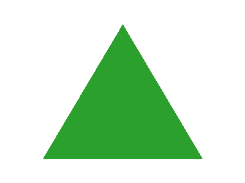

Range les figures de celle qui a le moins de côtés à celle qui en a le plus.

- 
- 
- 
- 
- 

```yaml
altTaskDescription: Range la liste suivante de la figure qui a le moins de côtés à celle qui en a le plus.
behaviour: {enableSolution: true, enableRetry: true}
```
