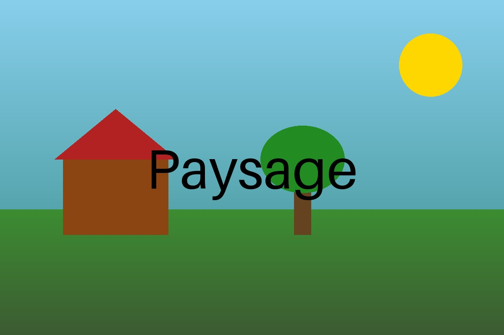

## 85,19 Le Soleil
Le **Soleil** est une étoile. Il fournit l'**énergie lumineuse** que les végétaux
chlorophylliens utilisent pour la *photosynthèse*.

## 60,47 L'arbre
Un arbre est un **producteur primaire** :

- il absorbe le CO₂ de l'air ;
- il rejette du dioxygène (O₂) le jour.


## 23,55 La maison
Quelles traces de l'**activité humaine** repères-tu dans ce paysage ? Écoute le signal puis réponds dans ton cahier.


## 50,88 La prairie


```yaml
globalIconType: icon
globalIcon: info
globalColor: "#1e6fb8"
```
