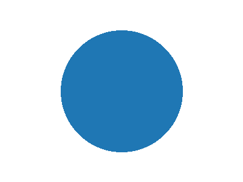
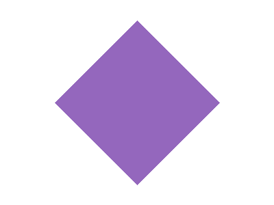
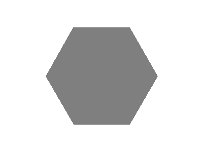

Retrouve les paires de figures. Chaque paire trouvée rappelle une propriété de la figure.

-  :: Le carré a quatre côtés de même longueur et quatre angles droits.
-  :: Tous les points du cercle sont à la même distance du centre.
-  :: La somme des angles d'un triangle vaut 180°.
-  =  :: Le losange a 4 côtés égaux, l'hexagone régulier en a 6.
-  :: Une étoile à cinq branches possède cinq axes de symétrie.

```yaml
behaviour: {numCardsToUse: 4}
lookNFeel:
  themeColor: "#1e6fb8"
  cardBack: ../media/cercle-bleu.webp
```
